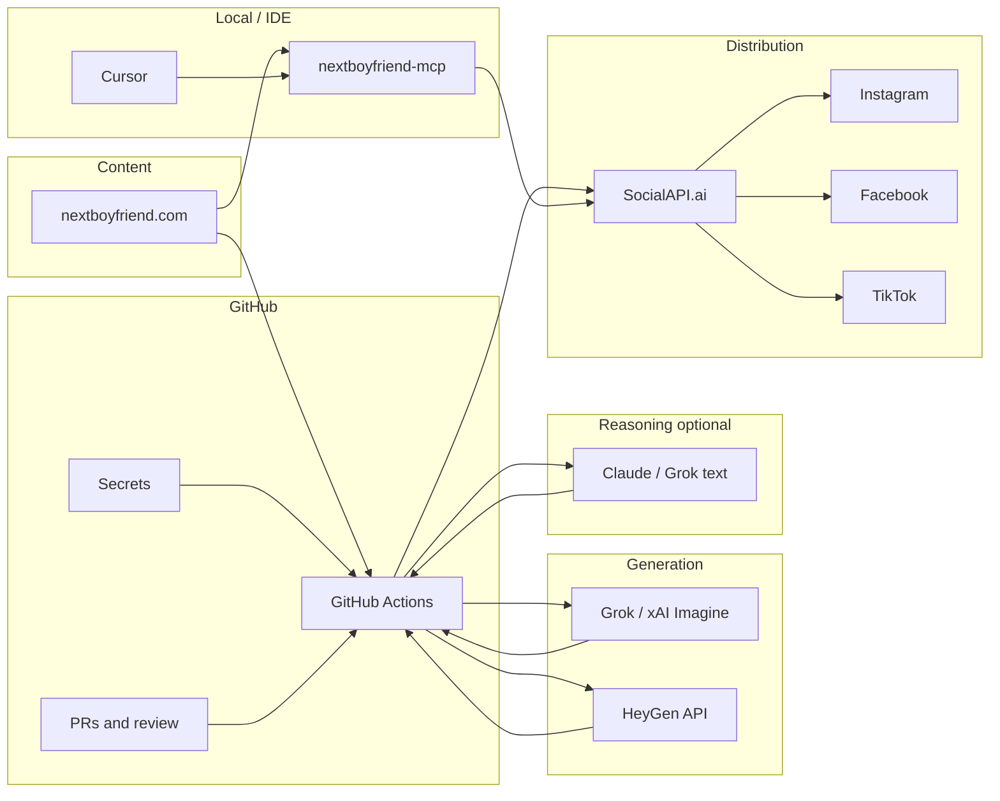

# Lights-out social automation — plan and action list

This document captures the **target architecture** (Next Boyfriend → multi-channel social), the **roles of each tool**, and a **checklist** to reach a reliable automated pipeline. It includes **HeyGen** for avatar/video steps and **GitHub** for scheduling, secrets, and auditability.

---

## What “lights out” means here

Fully unattended runs are rare on first iteration: you usually want **secrets in CI**, **idempotent article discovery**, **media generation**, **upload to SocialAPI**, **scheduled posts**, and **alerts on failure**. Human review (optional PR or approval step) stays available until metrics look stable.

---

## Architecture (high level)

---

## Tool-by-tool: role and what to verify

### Cursor + `nextboyfriend-mcp` (this repo)

| Item | Role | Inspect / action |
|------|------|------------------|
| MCP stdio server | Exposes SocialAPI operations to the model in Cursor | `npm run build && node dist/index.js` (stdio; use Cursor MCP config) |
| Current tools (see `src/index.ts`) | WordPress harvest, trends, posting plans, Pollinations, HeyGen, SocialAPI posting/analytics | Single file; extend or split modules as needed |
| Article dedupe | `.article-state.json` in project cwd (gitignored) | Written by `fetch_articles` |
| Env | `SOCAPI_KEY`, `ANTHROPIC_API_KEY`, optional `HEYGEN_API_KEY` | Document in GitHub Secrets for CI; never commit `.env` |

**Implemented (TikTok-only CI):** `src/run.ts` runs `runTikTokAutomation()` — harvests new WordPress posts (`harvestNewArticles`), pulls a Google Trends snippet, asks Claude for TikTok JSON (caption + hashtags + image prompt), builds a Pollinations image URL, then `POST /v1/posts` to the **TikTok** account (`AUTOMATION_TIKTOK_ACCOUNT_ID` or auto-detect from `/accounts`). Wire with **`.github/workflows/mcp.yml`**: `npm run build` → `npm run automate`. Set `AUTOMATION_DRY_RUN=true` until you trust the payload.

**Still optional / future:** Cloudflare Workers + D1/KV/R2 (this repo is Node + GitHub Actions today); HeyGen in the cron path; SocialAPI **media upload** (presign → `media_ids`) if your tenant rejects raw `media_urls`.

### GitHub

| Item | Role | Inspect / action |
|------|------|------------------|
| Repository | Source of truth for scripts and workflows | Branch protection optional |
| Actions | Scheduled (`cron`) or manual (`workflow_dispatch`) pipeline | Add workflow: install → build → run worker |
| Secrets | `SOCAPI_KEY`, `XAI_API_KEY`, `HEYGEN_API_KEY`, etc. | Repository → Settings → Secrets and variables |
| Environments | Optional approval gates for “prod” posting | `environment: production` + required reviewers |
| Artifacts / logs | Debug failed runs | Upload logs; never upload raw secrets |

### Grok / xAI (text + Imagine)

| Item | Role | Inspect / action |
|------|------|------------------|
| Chat API | Summaries, captions, hashtags | Rate limits and billing |
| Imagine / image API | Still images for carousels or covers | [xAI image docs](https://docs.x.ai/developers/model-capabilities/images/generation); output → upload to SocialAPI |

### HeyGen

| Item | Role | Inspect / action |
|------|------|------------------|
| Video Agent / templates | Generate talking-head or template videos from script | [HeyGen API](https://docs.heygen.com/); pick template vs agent flow |
| Webhooks | `avatar_video.success` / `.fail` (and related) | Public HTTPS endpoint or polling fallback; see [webhook docs](https://docs.heygen.com/docs/using-heygens-webhook-events) |
| Output | MP4 URL in webhook payload | Download in Actions → upload media to SocialAPI → `create_post` with `media_ids` |

**Note:** TikTok/IG often expect **video** for certain formats; HeyGen fills that gap vs Grok Imagine alone.

### SocialAPI.ai

| Item | Role | Inspect / action |
|------|------|------------------|
| Dashboard | Connect IG, Facebook, TikTok, etc. | Accounts → Connect OAuth |
| API | Posts, inbox, comments, usage | [docs.social-api.ai](https://docs.social-api.ai/) |
| Credits | Posts, interactions per billing period | Use `get_usage` MCP tool or `GET /v1/usage` |
| Media | Upload before `media_ids` on `create_post` | Implement upload in worker or add MCP tools |

### Claude (Anthropic)

| Item | Role | Inspect / action |
|------|------|------------------|
| SDK in `package.json` | `@anthropic-ai/sdk` present but **not wired** in `src/` | Either use in GitHub worker for captioning or remove dependency |
| Product / IDE | Alternative drafting surface to Grok | Same prompts; keep single “template” in repo to avoid drift |

### nextboyfriend.com

| Item | Role | Inspect / action |
|------|------|------------------|
| Discovery | RSS, sitemap, or CMS API | Pick one; store `seen_slugs` in `state/` or DB |
| Dedup | Prevent double-posting | Hash or slug list in persistent storage |

### Other tools (optional)

| Tool | Use |
|------|-----|
| **n8n / Make** | Visual orchestration instead of or alongside Actions |
| **Slack / email** | Alerts when Actions fail or HeyGen webhook errors |
| **S3 / R2** | Staging large video before SocialAPI upload if needed |

---

## Limitations (this assistant / environment)

The following are **not** available from a single chat session or from this repo alone:

| Gap | Implication |
|-----|-------------|
| No live connection to your **GitHub** org, **HeyGen** tenant, or **SocialAPI** dashboard | You must create keys, connect accounts, and add workflows locally or in the browser |
| No **public webhook URL** for HeyGen in dev | Use **polling** video status in Actions, or **ngrok** / a small cloud worker for webhooks |
| **MCP** is **stdio / local** | CI does not “run Cursor”; it runs **Node scripts** that call the same APIs the MCP wraps |
| **“Lights out”** still needs **you** to rotate keys, approve platform OAuth, and tune prompts | Treat as operational checklist, not one-click |

---

## Phased action checklist

Use this as a living list; check items off in PRs or issues.

### Phase 0 — Foundation

- [ ] Confirm SocialAPI accounts connected for **Instagram**, **Facebook**, **TikTok** (and any others).
- [ ] Store `SOCAPI_KEY` in GitHub **Secrets**; never commit `.env`.
- [ ] Run `list_accounts` via MCP and record `account_id` per platform in a **non-secret** config template (e.g. `config/accounts.example.json`).
- [ ] Decide article source: **RSS**, **sitemap**, or **CMS API** for nextboyfriend.com.

### Phase 1 — GitHub Actions skeleton

- [ ] Add `.github/workflows/social-pipeline.yml` with `workflow_dispatch` and optional `schedule`.
- [ ] Job: checkout → Node 20+ → `npm ci` → `npm run build` (for shared libs if extracted).
- [ ] Pass secrets into workflow env; log **redacted** success/failure only.

### Phase 2 — Content + captioning

- [ ] Reuse or mirror `fetch_articles` (WordPress + `.article-state.json`) in CI, or call MCP from a runner.
- [ ] Either wire **Anthropic SDK** in the worker or call **xAI** for captions; delete unused SDK if not used.
- [ ] Add prompt templates under `prompts/` or `config/` to avoid drift between Claude and Grok.

### Phase 3 — Media

- [ ] **Grok Imagine** (or xAI image): generate stills → SocialAPI **media upload** flow.
- [ ] **HeyGen**: script from article → create video job → **webhook or poll** → download MP4 → upload to SocialAPI.
- [ ] Add MCP tools or **shared module** for `presign upload → PUT → verify` so Cursor and Actions share code.

### Phase 4 — Publish

- [ ] Build `targets` from config; call SocialAPI `create_post` with `scheduled_at` for batching.
- [ ] Handle **sync publish** timeouts (prefer scheduling for long-running jobs).
- [ ] Monitor `get_usage` and platform-specific limits.

### Phase 5 — Hardening

- [ ] Slack/email on workflow failure.
- [ ] Optional: manual approval via **GitHub Environment** before `create_post`.
- [ ] Rotate API keys on a calendar; document owners.
- [ ] Keep `.article-state.json` gitignored (already listed in `.gitignore`).

---

## HeyGen-specific actions (summary)

- [ ] Create API key; confirm plan supports **Video Agent** or **template** generation you need.
- [ ] Register webhook URL (HTTPS) **or** implement **status polling** in Actions.
- [ ] Map webhook payload (`video_url`, etc.) to a step that **uploads** to SocialAPI and then **posts** with `media_ids`.
- [ ] Test failure paths (`avatar_video.fail`) so a bad run does not silently stop the pipeline.

---

## Single source of truth

| Topic | Location |
|-------|----------|
| This plan | `docs/AUTOMATION.md` |
| MCP tools + SocialAPI calls | `src/index.ts` |
| Article harvest dedupe | `.article-state.json` (gitignored) |

---

*Last updated: generated for nextboyfriend-mcp; revise as tools and APIs change.*
